# VisualGridDev Studio: Additional UML Diagrams

## Sequence Diagrams

### 1. Flow Deployment Sequence

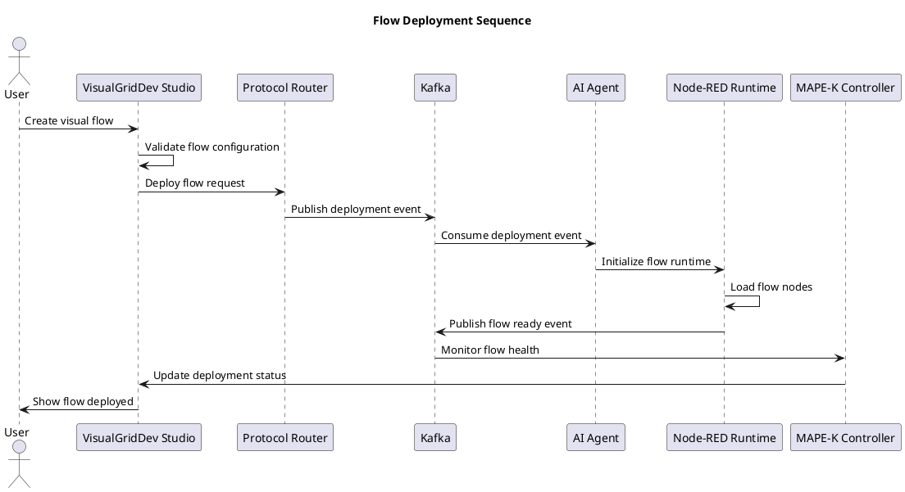

### 2. Self-Healing Sequence

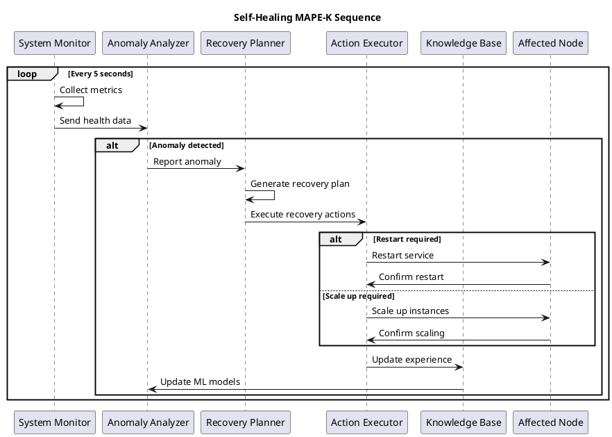

### 3. Agent-to-Agent Communication Sequence

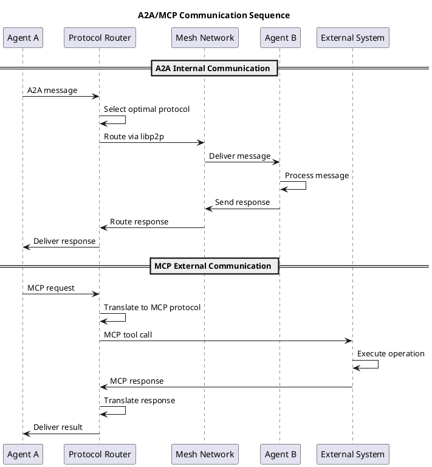

### 4. Edge Deployment Sequence

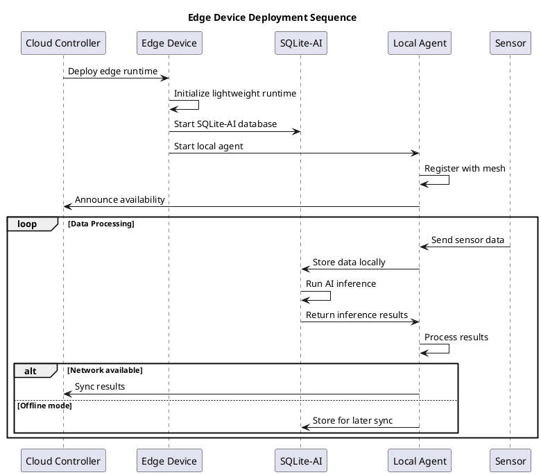

## State Diagrams

### 1. Node Lifecycle State Diagram

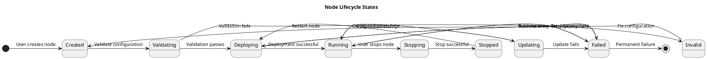

### 2. Flow Execution State Diagram

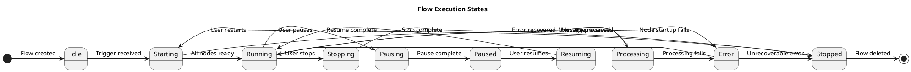

### 3. Agent State Diagram

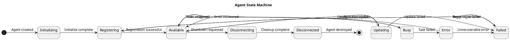

## Activity Diagrams

### 1. Visual Flow Creation Activity

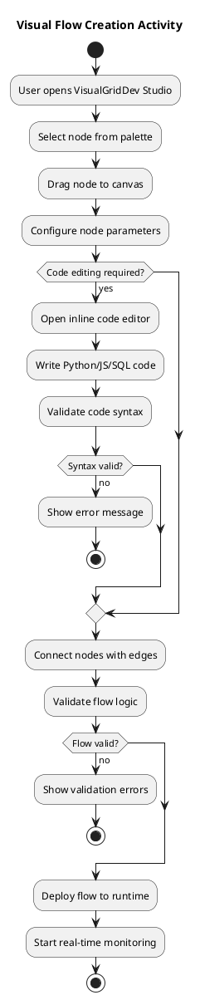

### 2. Self-Healing Activity

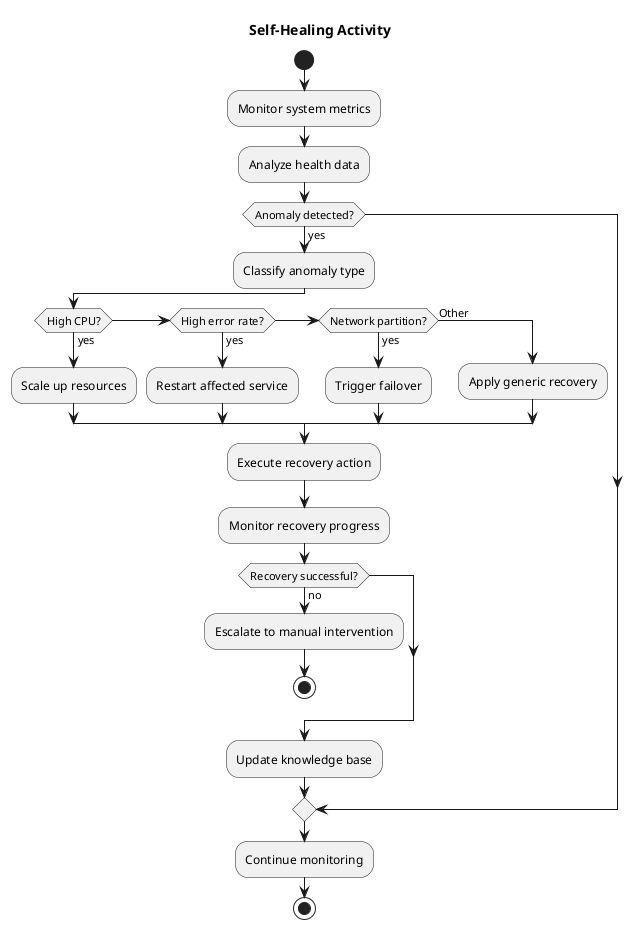

## Component Interaction Diagrams

### 1. Edge Computing Architecture

```plantuml
@startuml
title Edge Computing Component Interaction

package "Edge Device" {
    component "Edge Runtime" as EdgeRuntime
    component "SQLite-AI" as EdgeDB
    component "Local Agent" as EdgeAgent
    component "Sensor Interface" as Sensors
    component "Mesh Client" as MeshClient
}

package "Cloud Infrastructure" {
    component "Cloud Controller" as CloudCtrl
    component "Data Lake" as DataLake
    component "ML Pipeline" as MLPipeline
    component "Mesh Network" as MeshNet
}

Sensors -> EdgeAgent : Sensor data
EdgeAgent -> EdgeDB : Store/query data
EdgeDB -> EdgeAgent : AI inference results
EdgeAgent -> MeshClient : Sync with cloud
MeshClient -> MeshNet : Mesh communication
MeshNet -> CloudCtrl : Status updates
CloudCtrl -> DataLake : Aggregate data
DataLake -> MLPipeline : Training data
MLPipeline -> MeshNet : Model updates
MeshNet -> MeshClient : Deploy models
MeshClient -> EdgeDB : Update models

@enduml
```

### 2. Protocol Router Architecture

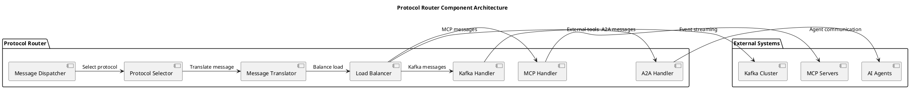

## Use Case Diagrams

### 1. VisualGridDev Studio Use Cases

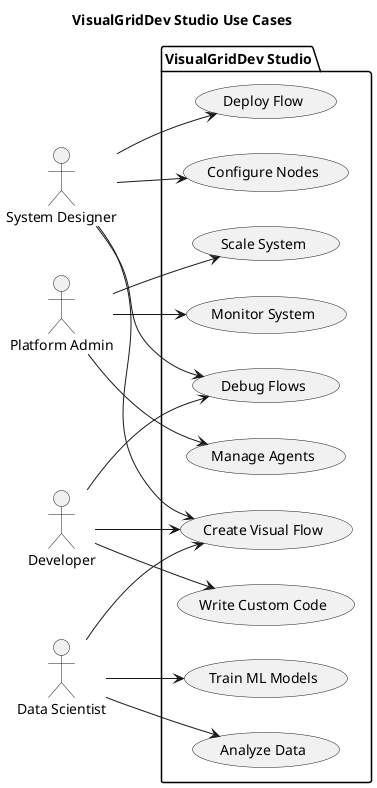

### 2. Edge Device Use Cases

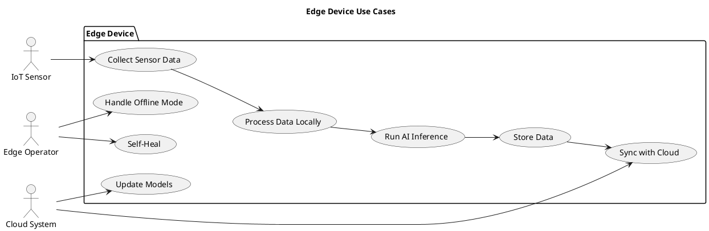

## Network Topology Diagrams

### 1. Mesh Network Topology

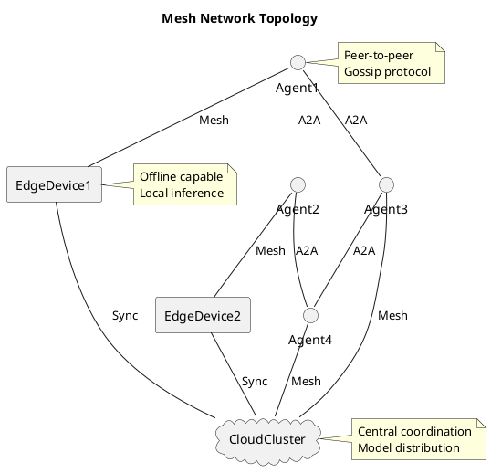

### 2. Data Flow Network

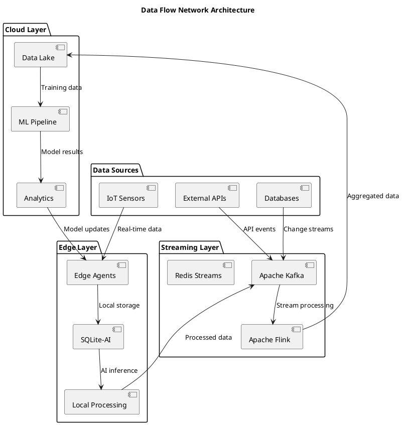

## Timing Diagrams

### 1. Real-time Flow Execution Timing

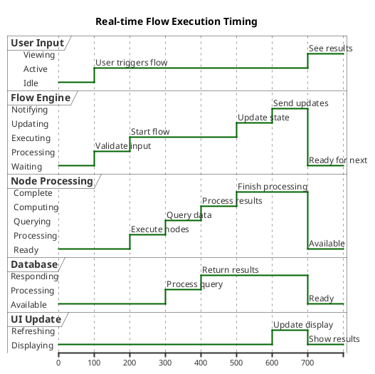

### 2. Self-Healing Response Timing

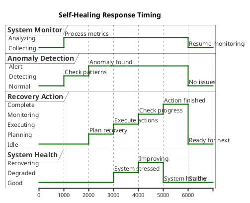