# VisualGridDev Studio: Edge System Diagrams

## Edge Computing Architecture Diagrams

### 1. Edge Device Internal Architecture

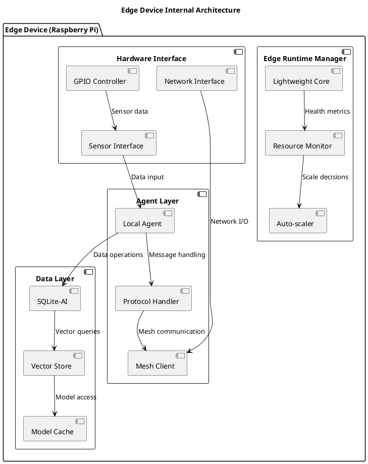

### 2. Edge-to-Cloud Synchronization

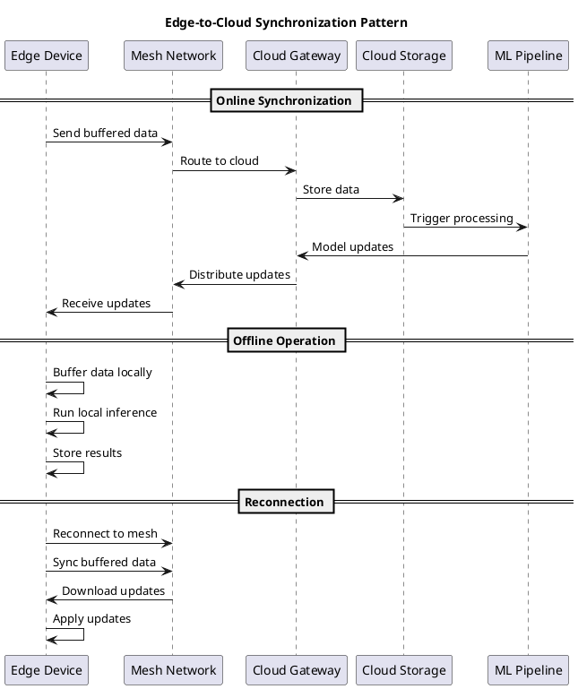

### 3. Edge Deployment State Machine

```plantuml
@startuml
title Edge Deployment State Machine

[*] -> Provisioning : Deploy command
Provisioning -> Downloading : Download runtime
Downloading -> Installing : Install complete
Installing -> Configuring : Installation done
Configuring -> Connecting : Configuration set
Connecting -> Syncing : Connected to mesh
Syncing -> Operational : Sync complete
Operational -> Updating : Update available
Updating -> Operational : Update complete
Operational -> Offline : Network lost
Offline -> Connecting : Network restored
Operational -> Maintenance : Maintenance mode
Maintenance -> Operational : Maintenance done
Operational -> Decommissioning : Shutdown command
Decommissioning -> [*] : Cleanup complete

@enduml
```

## Protocol Integration Diagrams

### 1. Multi-Protocol Message Flow

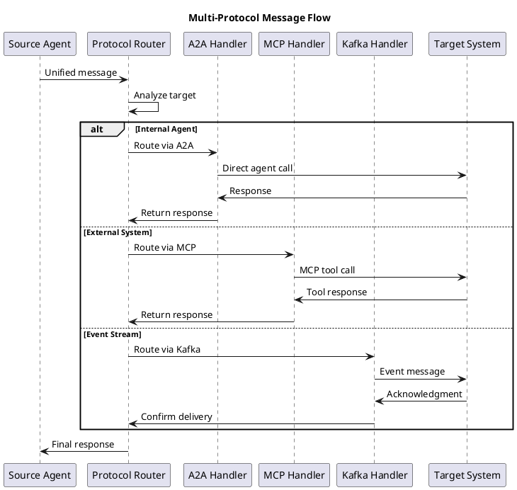

### 2. Protocol Negotiation Sequence

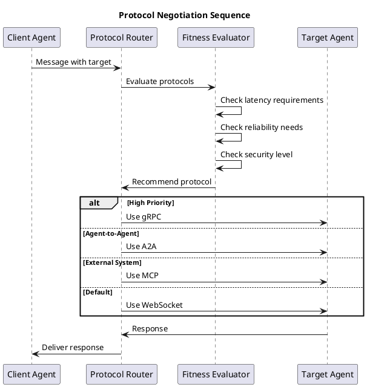

## System Integration Patterns

### 1. Microservices Integration Pattern

```plantuml
@startuml
title Microservices Integration Pattern

package "VisualGridDev Platform" {
    component "API Gateway" as Gateway
    component "Service Discovery" as Discovery
    component "Load Balancer" as LB
    
    package "Core Services" {
        component "Flow Engine" as FlowEngine
        component "Agent Manager" as AgentMgr
        component "Protocol Router" as Router
    }
    
    package "AI/ML Services" {
        component "Model Server" as ModelServer
        component "Training Service" as Training
        component "Inference Engine" as Inference
    }
    
    package "Data Services" {
        component "Data Ingestion" as Ingestion
        component "Stream Processor" as StreamProc
        component "Storage Service" as Storage
    }
}

Gateway -> Discovery: Service lookup
Discovery -> LB: Service endpoints
LB -> FlowEngine: Route requests
FlowEngine -> Router: Protocol routing
Router -> AgentMgr: Agent operations
AgentMgr -> ModelServer: ML requests
ModelServer -> Inference: Run inference
Training -> Storage: Store models
Ingestion -> StreamProc: Process streams
StreamProc -> Storage: Store results

@enduml
```

### 2. Event-Driven Architecture Pattern

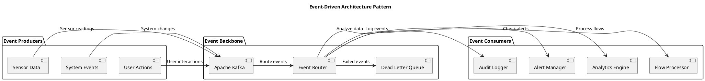

## Monitoring and Observability Diagrams

### 1. Distributed Tracing Flow

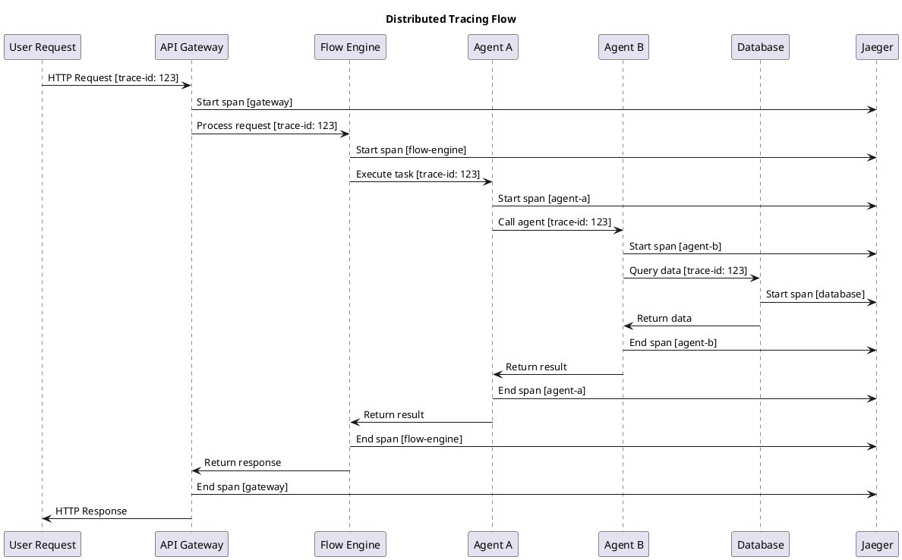

### 2. Health Check Architecture

```plantuml
@startuml
title Health Check Architecture

package "Health Monitoring System" {
    component "Health Aggregator" as Aggregator
    component "Alert Manager" as AlertMgr
    component "Dashboard" as Dashboard
    component "Notification Service" as Notify
}

package "System Components" {
    component "Agent Health" as AgentHealth
    component "Flow Health" as FlowHealth
    component "Database Health" as DBHealth
    component "Network Health" as NetHealth
}

package "External Monitoring" {
    component "Prometheus" as Prometheus
    component "Grafana" as Grafana
    component "PagerDuty" as PagerDuty
}

AgentHealth -> Aggregator: Health status
FlowHealth -> Aggregator: Flow metrics
DBHealth -> Aggregator: DB metrics
NetHealth -> Aggregator: Network status
Aggregator -> AlertMgr: Health summary
AlertMgr -> Dashboard: Display status
AlertMgr -> Notify: Send alerts
Aggregator -> Prometheus: Export metrics
Prometheus -> Grafana: Visualize data
Notify -> PagerDuty: Critical alerts

@enduml
```

## Security Architecture Diagrams

### 1. Zero-Trust Security Model

```plantuml
@startuml
title Zero-Trust Security Architecture

package "Identity Layer" {
    component "Identity Provider" as IdP
    component "Certificate Authority" as CA
    component "Token Service" as TokenSvc
}

package "Policy Layer" {
    component "Policy Engine" as PolicyEngine
    component "RBAC Controller" as RBAC
    component "Access Control" as AccessCtrl
}

package "Network Layer" {
    component "mTLS Gateway" as mTLS
    component "Network Policies" as NetPol
    component "Traffic Encryption" as Encryption
}

package "Application Layer" {
    component "Agent Authentication" as AgentAuth
    component "API Authorization" as APIAuth
    component "Audit Logger" as AuditLog
}

IdP -> TokenSvc: Issue tokens
CA -> mTLS: Issue certificates
TokenSvc -> AgentAuth: Validate tokens
AgentAuth -> RBAC: Check permissions
RBAC -> PolicyEngine: Evaluate policies
PolicyEngine -> AccessCtrl: Grant/deny access
mTLS -> Encryption: Secure transport
NetPol -> Encryption: Network isolation
AccessCtrl -> AuditLog: Log decisions
APIAuth -> AuditLog: Log API calls

@enduml
```

### 2. Data Encryption Flow

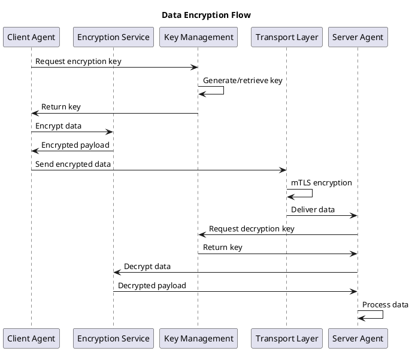

## Performance and Scaling Diagrams

### 1. Auto-scaling Architecture

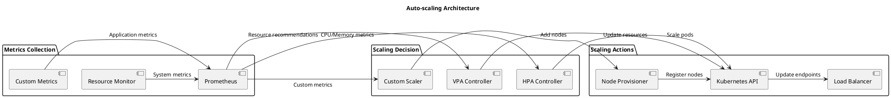

### 2. Load Distribution Pattern

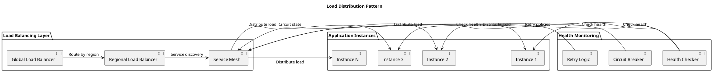