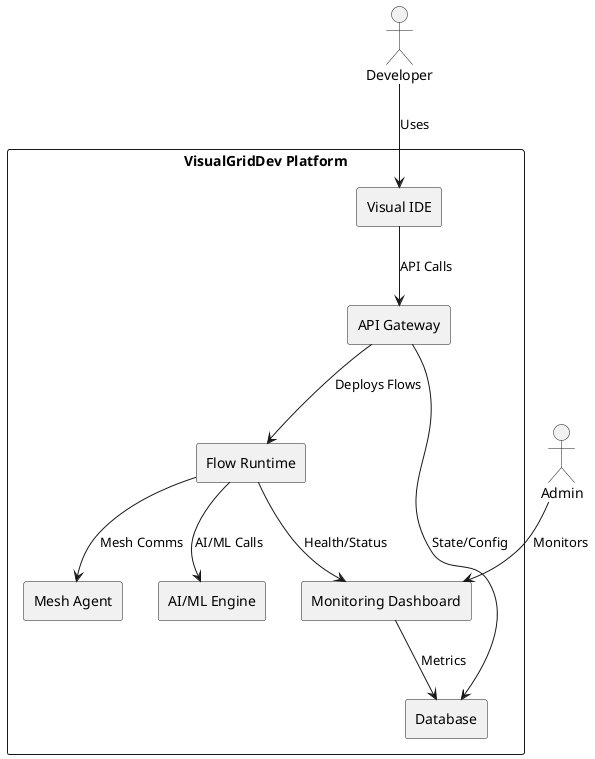
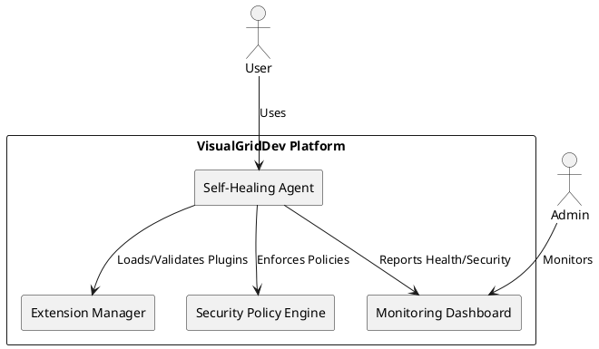
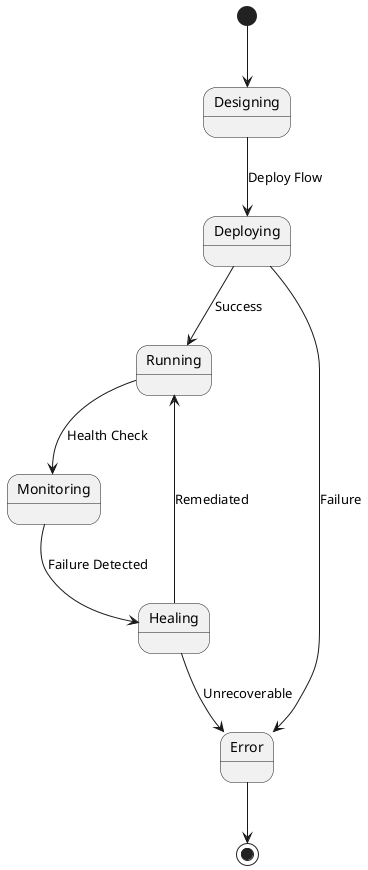
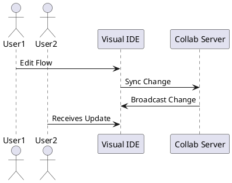
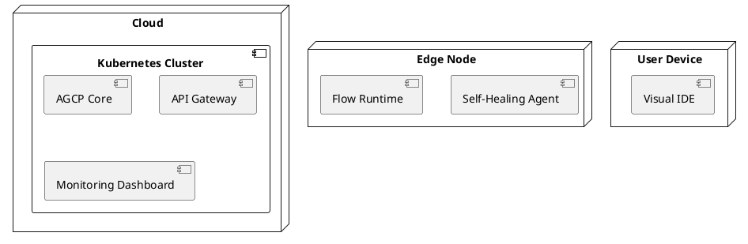
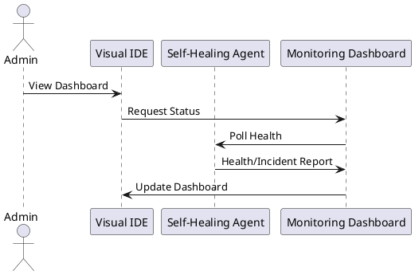

# VisualGridDev v5.0 - PlantUML Diagrams

This document contains PlantUML source for all required architecture diagrams: C4 (all levels), arc42, system, context, state, sequence, runtime, security, and deployment. Each diagram is referenced in the main documentation and can be rendered for visual clarity.

---

## 1. C4 Context Diagram

```plantuml
@startuml
!include https://raw.githubusercontent.com/plantuml-stdlib/C4-PlantUML/master/C4_Context.puml

Person(dev, "Developer")
Person(admin, "Admin")
System_Boundary(visualgriddev, "VisualGridDev Platform") {
  System(ide, "Visual IDE", "Web/VS Code")
  System(runtime, "Flow Runtime", "Node/Edge/Cloud")
  System(ai, "AI/ML Orchestrator", "LLM, ML, RAG")
  System(mesh, "Mesh Network", "libp2p, MQTT, etc.")
  System(monitor, "Monitoring Dashboard", "Real-time UI")
}
Rel(dev, ide, "Uses")
Rel(admin, monitor, "Monitors")
Rel(ide, runtime, "Deploys Flows")
Rel(runtime, mesh, "Joins Mesh")
Rel(runtime, ai, "Invokes AI/ML")
Rel(runtime, monitor, "Reports Health")
@enduml
```

---

## 2. C4 Container Diagram

```plantuml
@startuml
!include https://raw.githubusercontent.com/plantuml-stdlib/C4-PlantUML/master/C4_Container.puml

System_Boundary(visualgriddev, "VisualGridDev Platform") {
  Container(ide, "Visual IDE", "React/TS", "Visual programming, live collaboration")
  Container(api, "API Gateway", "Node.js/Express", "REST/gRPC/GraphQL")
  Container(runtime, "Flow Runtime", "Node.js/Python", "Executes agent flows")
  Container(mesh, "Mesh Agent", "libp2p, MQTT", "Self-healing, mesh comms")
  Container(ai, "AI/ML Engine", "Python/LLM", "Inference, RAG, learning")
  Container(monitor, "Monitoring Dashboard", "React/TS", "Real-time health/status")
  Container(db, "Database", "Postgres/Redis", "State, config, logs")
}
Rel(ide, api, "API calls")
Rel(api, runtime, "Deploys/Manages Flows")
Rel(runtime, mesh, "Mesh comms")
Rel(runtime, ai, "AI/ML calls")
Rel(runtime, monitor, "Health/Status")
Rel(api, db, "Reads/Writes")
Rel(monitor, db, "Reads Metrics")
@enduml
```

---

## 3. arc42 System Overview



---

## 4. Security Architecture Diagram



---

## 5. State Diagram: Flow Deployment & Healing



---

## 6. Sequence Diagram: Live Collaboration



---

## 7. Deployment Diagram



---

## 8. Runtime Diagram: Self-Healing & Monitoring



---

# End of PlantUML Diagrams
