# VisualGridDev Studio: Specialized System Diagrams

## Data Flow and Processing Diagrams

### 1. Real-time Data Pipeline

```plantuml
@startuml
title Real-time Data Processing Pipeline

!define QUEUE queue
!define PROCESSOR component
!define STORAGE database

QUEUE "Sensor Data\nQueue" as SensorQ
QUEUE "Event Stream\nQueue" as EventQ
QUEUE "ML Pipeline\nQueue" as MLQ

PROCESSOR "Data Ingestion\nService" as Ingestion
PROCESSOR "Stream Processor\n(Apache Flink)" as StreamProc
PROCESSOR "ML Inference\nEngine" as MLEngine
PROCESSOR "Alert Manager" as AlertMgr

STORAGE "Time Series DB\n(InfluxDB)" as TimeSeriesDB
STORAGE "Vector Database\n(Pinecone)" as VectorDB
STORAGE "Data Lake\n(Delta Lake)" as DataLake

SensorQ -> Ingestion: Raw sensor data
Ingestion -> EventQ: Normalized events
EventQ -> StreamProc: Real-time processing
StreamProc -> TimeSeriesDB: Store metrics
StreamProc -> MLQ: ML processing queue
MLQ -> MLEngine: Run inference
MLEngine -> VectorDB: Store embeddings
MLEngine -> AlertMgr: Anomaly alerts
StreamProc -> DataLake: Historical data
DataLake -> MLEngine: Training data

note right of StreamProc : Windowing, aggregation,\ncomplex event processing
note right of MLEngine : Real-time inference,\nanomalies detection
note right of DataLake : Batch processing,\nhistorical analysis

@enduml
```

### 2. ML Model Lifecycle

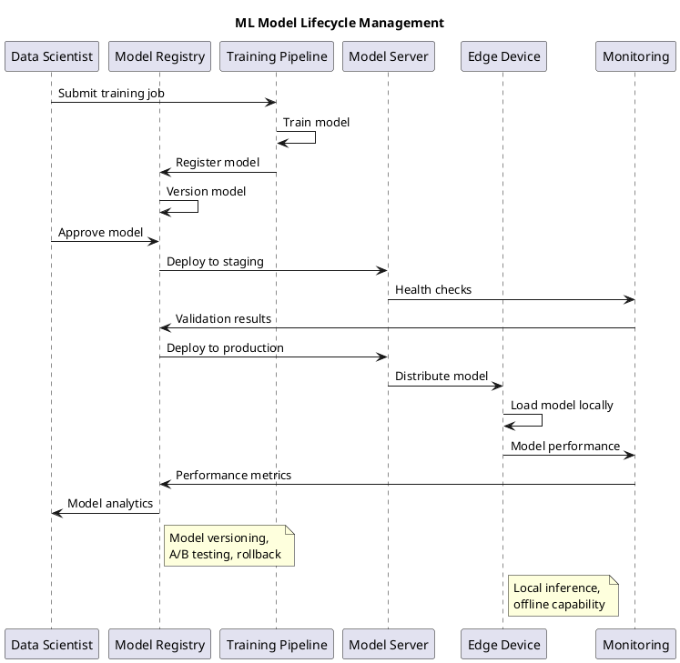

### 3. Event Sourcing Pattern

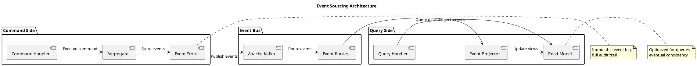

## Collaborative Features Diagrams

### 1. Real-time Collaboration Architecture

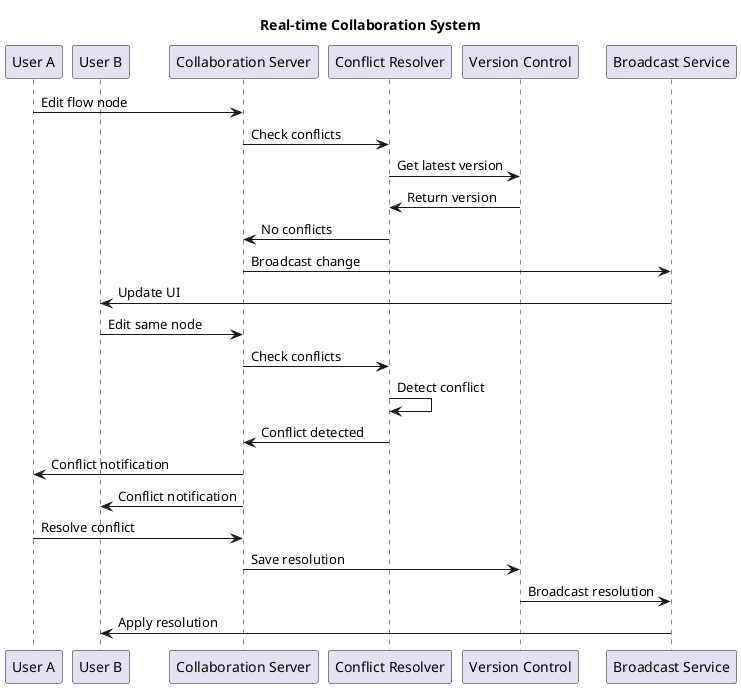

### 2. Operational Transformation

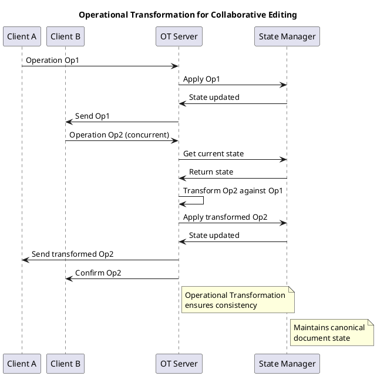

## Deployment and DevOps Diagrams

### 1. GitOps Deployment Pipeline

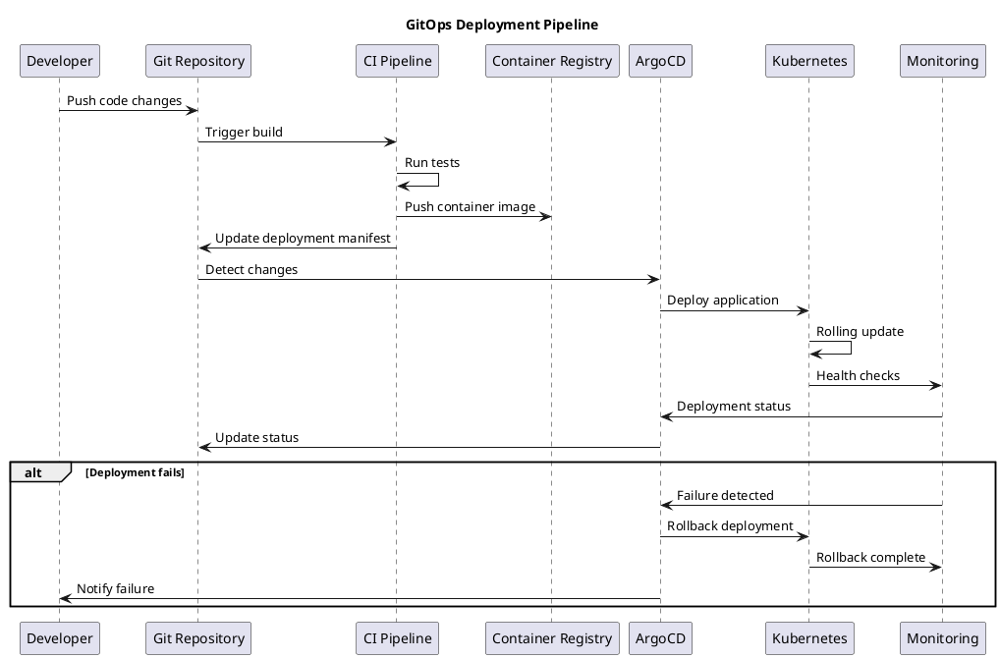

### 2. Multi-Environment Promotion

```plantuml
@startuml
title Multi-Environment Promotion Pipeline

package "Development" {
    component "Dev Cluster" as DevCluster
    component "Dev Tests" as DevTests
}

package "Staging" {
    component "Staging Cluster" as StagingCluster
    component "Integration Tests" as IntegrationTests
    component "Performance Tests" as PerfTests
}

package "Production" {
    component "Prod Cluster" as ProdCluster
    component "Canary Deployment" as Canary
    component "Blue-Green Deployment" as BlueGreen
}

DevCluster -> DevTests: Run unit tests
DevTests -> StagingCluster: Promote to staging
StagingCluster -> IntegrationTests: Run integration tests
IntegrationTests -> PerfTests: Run performance tests
PerfTests -> Canary: Deploy canary
Canary -> BlueGreen: Full deployment
BlueGreen -> ProdCluster: Switch traffic

note right of Canary : 5% traffic to new version
note right of BlueGreen : Zero-downtime deployment

@enduml
```

## Disaster Recovery Diagrams

### 1. Backup and Recovery Architecture

```plantuml
@startuml
title Backup and Recovery Architecture

package "Primary Site" {
    component "Primary Cluster" as Primary
    component "Primary Database" as PrimaryDB
    component "Application Data" as AppData
}

package "Backup Systems" {
    component "Backup Controller" as BackupCtrl
    component "Snapshot Service" as Snapshot
    component "Backup Storage" as BackupStorage
}

package "Secondary Site" {
    component "DR Cluster" as DRCluster
    component "DR Database" as DRDB
    component "Recovery Service" as Recovery
}

Primary -> BackupCtrl: Trigger backup
BackupCtrl -> Snapshot: Create snapshots
Snapshot -> BackupStorage: Store backups
PrimaryDB -> BackupStorage: Database backups
AppData -> BackupStorage: Application backups

alt Disaster occurs
    BackupStorage -> Recovery: Restore data
    Recovery -> DRCluster: Deploy services
    Recovery -> DRDB: Restore database
    DRCluster -> DRCluster: Validate recovery
end

@enduml
```

### 2. Failover Sequence

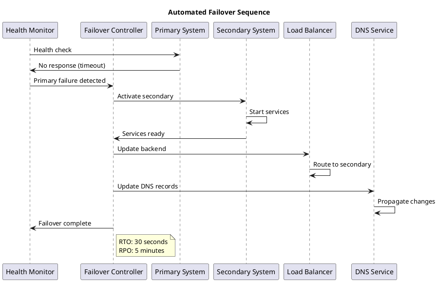

## Performance Optimization Diagrams

### 1. Caching Strategy

```plantuml
@startuml
title Multi-Level Caching Strategy

package "Client Layer" {
    component "Browser Cache" as BrowserCache
    component "Mobile Cache" as MobileCache
}

package "Edge Layer" {
    component "CDN Cache" as CDN
    component "Edge Cache" as EdgeCache
}

package "Application Layer" {
    component "Application Cache" as AppCache
    component "Session Cache" as SessionCache
    component "Redis Cache" as Redis
}

package "Database Layer" {
    component "Query Cache" as QueryCache
    component "Database" as Database
}

BrowserCache -> CDN: Cache miss
MobileCache -> CDN: Cache miss
CDN -> EdgeCache: Cache miss
EdgeCache -> AppCache: Cache miss
AppCache -> Redis: Cache miss
Redis -> QueryCache: Cache miss
QueryCache -> Database: Query data
Database -> QueryCache: Return data
QueryCache -> Redis: Cache result
Redis -> AppCache: Return data
AppCache -> EdgeCache: Cache data
EdgeCache -> CDN: Cache data
CDN -> BrowserCache: Return data

note right of Redis : Distributed cache\nfor session data
note right of QueryCache : Database-level\nquery optimization

@enduml
```

### 2. Performance Monitoring Flow

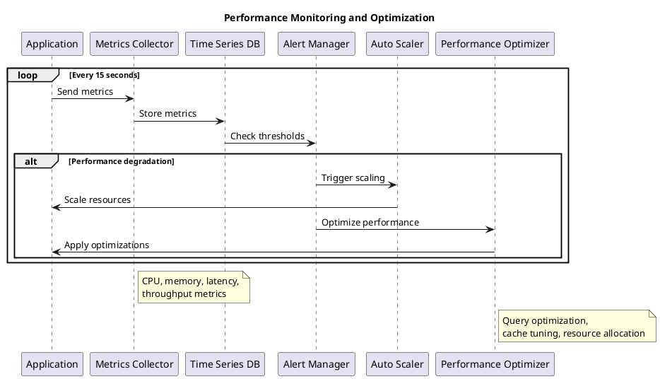

## Integration Testing Diagrams

### 1. End-to-End Testing Flow

```plantuml
@startuml
title End-to-End Testing Architecture

package "Test Environment" {
    component "Test Runner" as TestRunner
    component "Test Data Manager" as TestData
    component "Mock Services" as Mocks
}

package "System Under Test" {
    component "VisualGridDev Studio" as Studio
    component "Agent Network" as Agents
    component "Database" as DB
}

package "Validation" {
    component "Result Validator" as Validator
    component "Performance Monitor" as PerfMon
    component "Report Generator" as Reporter
}

TestRunner -> TestData: Setup test data
TestData -> DB: Initialize database
TestRunner -> Mocks: Start mock services
TestRunner -> Studio: Execute test scenarios
Studio -> Agents: Process workflows
Agents -> DB: Data operations
DB -> Validator: Validate results
Studio -> PerfMon: Performance metrics
PerfMon -> Validator: Performance validation
Validator -> Reporter: Generate reports
Reporter -> TestRunner: Test results

@enduml
```

### 2. Chaos Engineering Testing

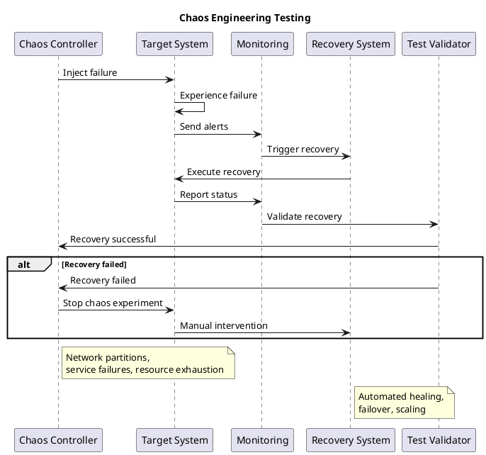