# VisualGridDev Studio: Visual UI and System Diagrams

## VisualGridDev Studio UI Mockups

### 1. Main Studio Interface

### 2. Node Configuration Dialog

### 3. Real-time Monitoring Dashboard

```plantuml
@startuml
!theme plain
skinparam backgroundColor #1a1a1a
skinparam rectangleBackgroundColor #2d3748
skinparam rectangleBorderColor #4a5568
skinparam fontColor #ffffff

title VisualGridDev Studio - Live Monitoring Dashboard

rectangle "System Overview" as overview {
  rectangle "🟢 Agents: 24/25 Active" as agents
  rectangle "📊 Throughput: 1,247 msg/sec" as throughput
  rectangle "⚡ Latency: 12ms avg" as latency
  rectangle "🔥 CPU: 45% | RAM: 62%" as resources
}

rectangle "Flow Execution Map" as flowmap {
  rectangle "Flow A" as flowA #90EE90
  rectangle "Flow B" as flowB #FFD700
  rectangle "Flow C" as flowC #FF6B6B
  
  flowA --> flowB : 🟢 healthy
  flowB --> flowC : 🟡 warning
  
  note right of flowA : 156 msg/min\n2ms latency
  note right of flowB : 89 msg/min\n15ms latency
  note right of flowC : 23 msg/min\n45ms latency
}

rectangle "Metrics Charts" as charts {
  rectangle "Message Volume\n📈 ▲ 15% from last hour" as volume
  rectangle "Error Rate\n📉 ▼ 0.02% (target: <0.1%)" as errors
  rectangle "Response Time\n📊 12ms avg (target: <50ms)" as response
}

rectangle "Active Alerts" as alerts {
  rectangle "🟡 High latency on Flow C" as alert1
  rectangle "🔴 Agent-007 disconnected" as alert2
  rectangle "🟢 Auto-scaling triggered +2 pods" as alert3
}

@enduml
```

## High-Level System Views

### 1. Data Flow View

### 2. Security View

### 3. General System View

### 4. Scalability View

```plantuml
@startuml
!theme plain
skinparam backgroundColor #f0f8ff

title VisualGridDev Studio - Scalability Architecture View

rectangle "Load Balancing Tier" as loadbalancer {
  rectangle "Global Load\nBalancer" as glb
  rectangle "Regional Load\nBalancer" as rlb
  rectangle "Service Mesh\nLoad Balancer" as smlb
}

rectangle "Auto-Scaling Groups" as autoscaling {
  rectangle "Web UI Pods\n(HPA: 2-20)" as webpods
  rectangle "API Gateway\n(HPA: 3-50)" as apipods
  rectangle "Agent Runtime\n(HPA: 5-100)" as agentpods
  rectangle "ML Services\n(HPA: 2-200)" as mlpods
}

rectangle "Data Scaling" as datascaling {
  rectangle "Kafka Cluster\n(9 brokers)" as kafka
  rectangle "Database\nSharding" as sharding
  rectangle "Cache Layer\n(Redis Cluster)" as cache
  rectangle "CDN\n(CloudFlare)" as cdn
}

rectangle "Compute Scaling" as compute {
  rectangle "Kubernetes\nNode Pools" as nodepools
  rectangle "Spot Instances\n(Cost Optimization)" as spot
  rectangle "GPU Nodes\n(ML Workloads)" as gpu
  rectangle "Edge Nodes\n(IoT Processing)" as edge
}

rectangle "Geographic Distribution" as geo {
  rectangle "US-East\n(Primary)" as useast
  rectangle "US-West\n(Secondary)" as uswest
  rectangle "EU-Central\n(GDPR)" as eu
  rectangle "Asia-Pacific\n(Low Latency)" as apac
}

loadbalancer --> autoscaling : distribute traffic
autoscaling --> datascaling : data operations
datascaling --> compute : resource allocation
compute --> geo : regional deployment

note right of glb : DNS-based routing\nHealth checks
note right of webpods : React app\nStateless scaling
note right of agentpods : A2A agents\nHorizontal scaling
note right of kafka : 1M+ msg/sec\nPartitioned topics
note right of nodepools : Auto-provisioning\nMulti-zone deployment

rectangle "Scaling Metrics" as metrics {
  rectangle "📊 CPU: 70% threshold" as cpu
  rectangle "📈 Memory: 80% threshold" as memory
  rectangle "🔄 Queue Depth: 1000 msgs" as queue
  rectangle "⚡ Response Time: 100ms" as response
  rectangle "👥 Concurrent Users: 10K" as users_metric
}

rectangle "Scaling Actions" as actions {
  rectangle "🔄 Horizontal Pod Autoscaler" as hpa
  rectangle "📈 Vertical Pod Autoscaler" as vpa
  rectangle "🌐 Cluster Autoscaler" as ca
  rectangle "⚡ Custom Metrics Scaler" as custom
}

metrics --> actions : trigger scaling
actions --> autoscaling : scale resources

@enduml
```

## System Flow Visualization

### 5. End-to-End Message Flow

### 6. Deployment Flow Visualization

```plantuml
@startuml
!theme plain
skinparam backgroundColor #f5f5f5

title VisualGridDev Studio - Deployment Flow Visualization

rectangle "Development" as dev {
  rectangle "👨‍💻 Developer\nWorkstation" as developer
  rectangle "🔧 Local Testing\n& Validation" as testing
  rectangle "📝 Git Repository\n(Source Code)" as git
}

rectangle "CI/CD Pipeline" as cicd {
  rectangle "🏗️ Build Process\n(Docker Images)" as build
  rectangle "🧪 Automated Tests\n(Unit/Integration)" as tests
  rectangle "📦 Artifact Registry\n(Container Images)" as registry
  rectangle "🚀 Deployment\nOrchestrator" as deploy
}

rectangle "Staging Environment" as staging {
  rectangle "🎭 Staging Cluster\n(K8s)" as stagingk8s
  rectangle "🔍 Performance Tests\n& Validation" as perftest
  rectangle "✅ Approval Gate\n(Manual/Auto)" as approval
}

rectangle "Production Environment" as production {
  rectangle "🌐 Production Cluster\n(Multi-Region)" as prodk8s
  rectangle "📊 Monitoring\n& Observability" as monitoring
  rectangle "🔄 Auto-scaling\n& Self-healing" as autoscaling
}

developer -> testing: code changes
testing -> git: commit & push
git -> build: trigger build
build -> tests: run tests
tests -> registry: push images
registry -> deploy: deploy to staging
deploy -> stagingk8s: kubernetes deploy
stagingk8s -> perftest: run tests
perftest -> approval: validation results
approval -> prodk8s: promote to production
prodk8s -> monitoring: health checks
monitoring -> autoscaling: metrics & alerts

note right of build : Multi-stage builds\nSecurity scanning
note right of tests : Unit, integration,\nend-to-end tests
note right of stagingk8s : Blue-green deployment\nCanary releases
note right of prodk8s : Rolling updates\nZero-downtime deployment

@enduml
```

