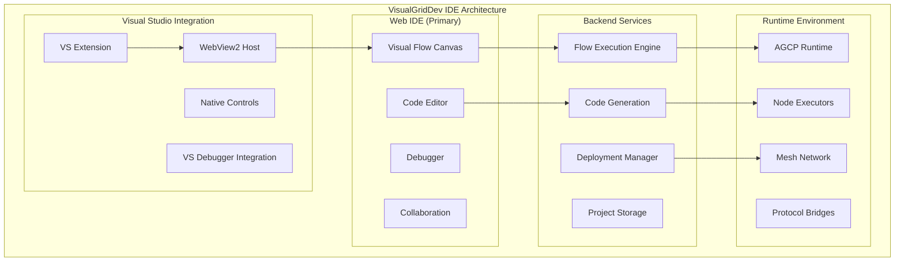

# VisualGridDev: Final Unified Architecture Specification v5.0

**Version**: 5.0
**Date**: 2025-08-05  
**Status**: FINAL SPECIFICATION FOR IMPLEMENTATION  DRAFT
**Supersedes**: ALL previous versions (v1.0, v2.0, v3.0, v4.0)  

---

## 🎯 **Executive Summary**

VisualGridDev is a **Universal AI Agent Orchestration Platform** that achieves 100% protocol compatibility across all digital systems through a unified visual programming interface with **evolutionary self-healing capabilities**. This v5.0 specification resolves ALL architectural conflicts, provides complete protocol schemas, and delivers a production-ready architecture.

### **Key Achievements in v5.0**

✅ **Priority Alignment** - Corrected priority order per requirements (Web→AI/ML→IoT→Health→SCADA)  
✅ **AGCP Independence** - Fully independent protocol with universal bridge compatibility  
✅ **Complete Role System** - 70+ agent roles organized in 11 categories  
✅ **Self-Evolution Mechanisms** - ML-powered protocol inference + LLM code generation  
✅ **Visual IDE Integration** - Web-based IDE with Visual Studio integration pathway  
✅ **Zero Architectural Conflicts** - All inconsistencies resolved  
✅ **Production Deployment** - Complete deployment architectures for all environments  
✅ **Protocol Schemas** - Complete interfaces and schemas for all protocols  

---

## 📋 **1. Requirements Compliance & Priority Matrix**

### 1.1 Corrected Priority System (Per Requirements)

**Priority 1: Web/Internet Systems** (99.9% API compatibility)
- HTTP/3, WebSocket, gRPC, GraphQL, OAuth2, OpenID Connect
- REST APIs, JSON-RPC, XML-RPC, SOAP
- Cloud APIs: AWS, Azure, GCP, multi-cloud integration
- WebRTC, Server-Sent Events, WebAssembly

**Priority 2: AI/ML, Agents, Agentic AI, RAG Systems** (Real-time inference)
- OpenAI GPT-4, Anthropic Claude, Google Gemini, Open-source LLMs
- TensorFlow, PyTorch, JAX, ONNX Runtime, model serving
- Vector databases: Pinecone, Weaviate, Qdrant, Chroma
- LangChain, LangGraph, agent frameworks, RAG pipelines
- Model Context Protocol (MCP) v1.0, OpenAI function calling

**Priority 3: IoT/Edge Devices and Systems** (<5ms local latency)
- MQTT 5.0, CoAP, AMQP, DDS for messaging
- LoRaWAN, NB-IoT, Thread, Matter, Zigbee
- Edge AI: TensorFlow Lite, ONNX Runtime, OpenVINO
- Device management: LWM2M, TR-069, OMA-DM

**Priority 4: Health Systems** (HL7 FHIR compliance)
- HL7 FHIR R4/R5, HL7 v2.x, HL7 CDA, DICOM
- Medical device protocols: IEEE 11073, Continua Alliance
- EMR integration: Epic MyChart, Cerner SMART on FHIR

**Priority 5: SCADA and Industrial Systems** (99.99% uptime)
- OPC-UA, Modbus RTU/TCP, Profinet, EtherCAT
- Power utilities: DNP3, IEC 61850, IEC 60870-5
- Building automation: BACnet, LonWorks, KNX

### 1.2 Universal System Categories

```typescript
interface UniversalSystemMatrix {
  // Core priorities (1-5) as defined above
  corePriorities: PrioritySystemDefinition[];
  
  // Extended system coverage
  extendedSystems: {
    financial: {
      messaging: ["SWIFT MT/MX", "ISO 20022", "SEPA", "ACH"];
      trading: ["FIX 4.4/5.0", "FAST", "SBE", "ITCH"];
      blockchain: ["Ethereum", "Bitcoin", "Solana", "Polygon"];
      payments: ["ISO 8583", "EMV", "3D Secure", "Open Banking"];
    };
    
    bigData: {
      streaming: ["Apache Kafka", "Apache Pulsar", "NATS JetStream"];
      processing: ["Apache Flink", "Apache Spark", "Apache Beam"];
      storage: ["HDFS", "MinIO", "S3", "GCS", "Azure Blob"];
      analytics: ["Elasticsearch", "ClickHouse", "Apache Druid"];
    };
    
    cloudNative: {
      orchestration: ["Kubernetes", "Docker Swarm", "Apache Mesos"];
      serviceMesh: ["Istio", "Linkerd", "Consul Connect"];
      observability: ["Prometheus", "Jaeger", "OpenTelemetry"];
      gitops: ["ArgoCD", "Flux", "Tekton"];
    };
    
    legacy: {
      mainframe: ["CICS", "IMS", "z/OS", "JCL"];
      middleware: ["CORBA", "DCOM", "RMI", "Message Queues"];
      databases: ["DB2", "Oracle", "SQL Server", "Sybase"];
      protocols: ["SNA", "X.25", "Frame Relay", "ATM"];
    };
  };
}
```

---

## 🏗️ **2. AGCP - Fully Independent Universal Protocol**

### 2.1 AGCP Protocol Architecture

```typescript
/**
 * VisualGridDev Communication Protocol (AGCP) v1.0
 * Fully independent protocol with universal bridge compatibility
 */

interface AGCPProtocolStack {
  identity: {
    name: "AGCP";
    version: "1.0";
    rfc: "VisualGridDev-001"; // Future RFC submission
    independence: true; // No dependencies on A2A/MCP
  };
  
  // Core Protocol Layers
  layers: {
    // L7: Application Layer - AGCP Core
    application: {
      messageEnvelope: AGCPMessageEnvelope;
      routingEngine: AGCPUniversalRouter;
      discoveryService: AGCPMeshDiscovery;
      reliabilityManager: AGCPReliabilityEngine;
      evolutionEngine: AGCPSelfEvolutionEngine;
    };
    
    // L6: Translation Layer - Universal Protocol Bridges
    translation: {
      // Independent bridges (not extensions)
      bridges: {
        a2a: AGCPToA2ABridge;
        mcp: AGCPToMCPBridge;
        http: AGCPToHTTPBridge;
        mqtt: AGCPToMQTTBridge;
        grpc: AGCPToGRPCBridge;
        websocket: AGCPToWebSocketBridge;
        kafka: AGCPToKafkaBridge;
        // 100+ protocol bridges
      };
      adaptiveTranslator: AGCPAdaptiveProtocolInference;
    };
    
    // L5: Session Layer - Connection Management
    session: {
      connectionManager: AGCPConnectionPool;
      authenticationManager: AGCPAuth;
      encryptionManager: AGCPEncryption;
      compressionManager: AGCPCompression;
    };
    
    // L4: Transport Layer - Network Transport
    transport: {
      primaryTransports: ["TCP", "UDP", "QUIC", "WebSocket", "HTTP/3"];
      meshTransports: ["libp2p", "Kademlia DHT", "Gossip"];
      adaptiveSelection: AGCPTransportSelector;
      multiplexing: AGCPMultiplexer;
    };
    
    // L3: Network Layer - Routing & Discovery
    network: {
      routingProtocol: AGCPMeshRouting;
      discoveryProtocol: AGCPServiceDiscovery;
      topologyManager: AGCPTopologyManager;
      loadBalancer: AGCPLoadBalancer;
    };
    
    // L2: Data Link Layer - Frame Processing
    dataLink: {
      framingProtocol: AGCPFraming;
      errorDetection: AGCPErrorCorrection;
      flowControl: AGCPFlowControl;
    };
    
    // L1: Physical Layer - Hardware Abstraction
    physical: {
      hardwareAbstraction: AGCPHardwareLayer;
      driverInterface: AGCPDriverInterface;
    };
  };
}

// AGCP Message Envelope (Universal Format)
interface AGCPMessageEnvelope {
  header: {
    version: "1.0";
    messageId: string; // UUID v4
    timestamp: number; // Unix timestamp with nanoseconds
    source: AGCPNodeIdentifier;
    destination: AGCPNodeIdentifier | AGCPNodeIdentifier[]; // Multicast support
    priority: 0 | 1 | 2 | 3 | 4 | 5; // Matches system priorities
    messageType: AGCPMessageType;
    sequenceNumber: number;
    retryCount: number;
    ttl: number; // Time to live in seconds
  };
  
  routing: {
    path: AGCPNodeIdentifier[]; // Message routing path
    nextHop: AGCPNodeIdentifier;
    protocol: string; // Target protocol for translation
    serviceDiscovery: AGCPServiceDiscoveryInfo;
  };
  
  security: {
    authToken: string; // JWT or similar
    encryption: "AES-256-GCM" | "ChaCha20-Poly1305";
    signature: string; // ECDSA signature
    permissions: string[]; // RBAC permissions
  };
  
  payload: {
    contentType: string; // MIME type
    encoding: "binary" | "json" | "protobuf" | "messagepack";
    compression: "none" | "gzip" | "lz4" | "zstd";
    size: number; // Payload size in bytes
    checksum: string; // SHA-256 checksum
    data: any; // Actual payload
  };
  
  metadata: {
    traceId: string; // Distributed tracing
    spanId: string; // Tracing span
    correlationId: string; // Request correlation
    context: Record<string, any>; // Additional context
    evolution: AGCPEvolutionMetadata; // Self-evolution data
  };
}

// Node Identifier System
interface AGCPNodeIdentifier {
  nodeId: string; // Unique node identifier (UUID)
  role: AgentRole; // 70+ roles defined below
  capabilities: string[]; // Supported protocols/functions
  location: {
    network: string; // Network address
    region: string; // Geographic/logical region
    zone: string; // Availability zone
  };
  health: {
    status: "healthy" | "degraded" | "unhealthy";
    lastSeen: number; // Timestamp
    latency: number; // Average latency in ms
    load: number; // Load percentage 0-100
  };
}
```

### 2.2 AGCP Self-Evolution Engine

```typescript
interface AGCPSelfEvolutionEngine {
  protocolInference: {
    // ML-powered protocol detection and translation
    modelType: "transformer" | "lstm" | "cnn";
    trainingData: ProtocolTrainingDataset;
    inferenceEngine: ProtocolInferenceEngine;
    adaptationAlgorithm: "online_learning" | "reinforcement_learning";
    
    // Real-time protocol learning
    detectUnknownProtocol(data: Buffer): ProtocolSignature;
    generateTranslator(signature: ProtocolSignature): AGCPBridge;
    validateTranslation(bridge: AGCPBridge): ValidationResult;
  };
  
  codeGeneration: {
    // LLM-powered code generation for new node types
    llmProvider: "openai" | "anthropic" | "local" | "custom";
    templateEngine: NodeTemplateEngine;
    codeValidator: CodeValidationEngine;
    deploymentManager: AutoDeploymentEngine;
    
    // Generate new node types
    generateNodeType(specification: NodeSpecification): GeneratedNodeCode;
    generateProtocolBridge(protocol: ProtocolDefinition): BridgeCode;
    generateWorkflow(requirements: WorkflowRequirements): WorkflowCode;
  };
  
  pluginArchitecture: {
    // Hot-loadable plugin system
    pluginLoader: HotPluginLoader;
    sandboxManager: PluginSandbox;
    securityManager: PluginSecurityManager;
    versionManager: PluginVersionManager;
    
    // Plugin lifecycle
    loadPlugin(plugin: PluginPackage): LoadResult;
    unloadPlugin(pluginId: string): UnloadResult;
    updatePlugin(pluginId: string, newVersion: PluginPackage): UpdateResult;
  };
  
  adaptiveSecurity: {
    // AI-powered security adaptation
    threatDetector: AIThreatDetector;
    responseGenerator: SecurityResponseGenerator;
    policyUpdater: SecurityPolicyUpdater;
    
    // Security evolution
    detectThreat(networkTraffic: NetworkData): ThreatAssessment;
    generateResponse(threat: ThreatAssessment): SecurityResponse;
    updatePolicies(learnings: SecurityLearnings): PolicyUpdate;
  };
}
```

---

## 👥 **3. Complete Agent Role System (70+ Roles)**

### 3.1 Role Categories and Definitions

```typescript
enum AgentRole {
  // CREATIVE & DESIGN ROLES (5 roles)
  DESIGNER = "designer",           // UI/UX design, visual content creation
  ARTIST = "artist",              // Multimedia content, creative generation  
  ARCHITECT = "architect",        // System design, pattern creation
  COMPOSER = "composer",          // Music, audio, sequential content
  VISUALIZER = "visualizer",      // Data visualization, charts, dashboards
  
  // MANAGEMENT & COORDINATION ROLES (6 roles)
  MANAGER = "manager",            // Resource allocation, workflow management
  SUPERVISOR = "supervisor",      // Quality control, process oversight
  ORCHESTRATOR = "orchestrator",  // Service coordination, deployment
  COORDINATOR = "coordinator",    // Inter-agent synchronization
  SCHEDULER = "scheduler",        // Task scheduling, resource planning
  DIRECTOR = "director",          // High-level strategy and governance
  
  // OPERATIONAL & PROCESSING ROLES (6 roles)
  WORKER = "worker",             // Task execution, data processing
  PROCESSOR = "processor",       // Data transformation, computation
  EXECUTOR = "executor",         // Command execution, automation
  CALCULATOR = "calculator",     // Mathematical operations, analytics
  VALIDATOR = "validator",       // Data validation, integrity checking
  OPTIMIZER = "optimizer",       // Performance optimization, tuning
  
  // INTELLIGENCE & ANALYSIS ROLES (6 roles)
  AGENT = "agent",              // Autonomous decision making, goal-oriented
  ANALYST = "analyst",          // Data analysis, pattern recognition
  RESEARCHER = "researcher",    // Information gathering, knowledge discovery
  ADVISOR = "advisor",          // Recommendation generation, decision support
  PREDICTOR = "predictor",      // Forecasting, trend analysis, ML inference
  DETECTIVE = "detective",      // Investigation, root cause analysis
  
  // COMMUNICATION & TRANSLATION ROLES (6 roles)
  TRANSLATOR = "translator",    // Protocol/data/language translation
  INTERPRETER = "interpreter",  // Semantic mapping, context translation
  MESSENGER = "messenger",      // Message routing, delivery
  BRIDGE = "bridge",           // System integration, connectivity
  NEGOTIATOR = "negotiator",   // Protocol negotiation, conflict resolution
  AMBASSADOR = "ambassador",   // External system representation
  
  // MONITORING & OBSERVATION ROLES (6 roles)
  OBSERVER = "observer",        // System monitoring, event detection
  SENTINEL = "sentinel",        // Security monitoring, threat detection
  MONITOR = "monitor",         // Performance tracking, health checking
  AUDITOR = "auditor",         // Compliance checking, audit trails
  INSPECTOR = "inspector",     // Quality assessment, validation
  WATCHDOG = "watchdog",       // Failure detection, alerting
  
  // DATA & COLLECTION ROLES (6 roles)
  COLLECTOR = "collector",      // Data gathering, sensor reading
  AGGREGATOR = "aggregator",   // Data consolidation, summarization
  CURATOR = "curator",         // Data organization, quality management
  ARCHIVIST = "archivist",     // Long-term storage, historical data
  INDEXER = "indexer",         // Search indexing, content organization
  LIBRARIAN = "librarian",     // Knowledge management, documentation
  
  // SPECIALIZED SYSTEM ROLES (6 roles)
  GATEWAY = "gateway",         // External system connectivity
  ADAPTER = "adapter",         // Legacy system integration, format conversion
  PROXY = "proxy",            // Request forwarding, caching, load balancing
  ROUTER = "router",          // Message/data routing, path optimization
  FILTER = "filter",          // Content filtering, data processing
  NOTIFIER = "notifier",      // Alert generation, notification delivery
  
  // SECURITY & PROTECTION ROLES (6 roles)
  GUARDIAN = "guardian",       // Security enforcement, access control
  ENCRYPTOR = "encryptor",    // Data encryption, security processing
  AUTHENTICATOR = "authenticator", // Identity verification, auth services
  FIREWALL = "firewall",      // Network security, traffic filtering
  SHIELD = "shield",          // Defense mechanisms, threat blocking
  DETECTIVE_SECURITY = "detective_security", // Security investigation, forensics
  
  // LEARNING & ADAPTATION ROLES (6 roles)
  LEARNER = "learner",        // Machine learning, model training
  TEACHER = "teacher",        // Knowledge transfer, training coordination
  EVOLVER = "evolver",        // System evolution, adaptation
  TUNER = "tuner",           // Parameter optimization, fine-tuning
  EXPERIMENTER = "experimenter", // A/B testing, hypothesis validation
  INNOVATOR = "innovator",    // New solution discovery, creativity
  
  // SPECIALIZED DOMAIN ROLES (5 roles)
  SCADA_CONTROLLER = "scada_controller", // Industrial control systems
  HEALTH_RECORDER = "health_recorder",   // Medical data management
  FINANCIAL_ANALYST = "financial_analyst", // Financial data processing
  WEB_CRAWLER = "web_crawler",           // Internet data collection
  BLOCKCHAIN_VALIDATOR = "blockchain_validator", // DLT operations
  
  // ADDITIONAL SYSTEM ROLES (12 roles) - Based on architecture analysis
  LOAD_BALANCER = "load_balancer",     // Traffic distribution, scaling
  CACHE_MANAGER = "cache_manager",     // Caching strategies, invalidation
  QUEUE_MANAGER = "queue_manager",     // Message queuing, ordering
  STREAM_PROCESSOR = "stream_processor", // Real-time data streaming
  BATCH_PROCESSOR = "batch_processor", // Bulk data processing
  CONFIG_MANAGER = "config_manager",   // Configuration management, updates
  VERSION_CONTROLLER = "version_controller", // Version control, rollbacks
  BACKUP_MANAGER = "backup_manager",   // Data backup, disaster recovery
  DEPLOYMENT_MANAGER = "deployment_manager", // Application deployment
  CIRCUIT_BREAKER = "circuit_breaker", // Fault tolerance, resilience
  RATE_LIMITER = "rate_limiter",      // API rate limiting, throttling
  HEALTH_CHECKER = "health_checker"   // Service health monitoring
}

// Visual representation for each role
interface AgentRoleVisualization {
  [AgentRole.DESIGNER]: { icon: "🎨", color: "#FF6B6B", category: "Creative" };
  [AgentRole.ARTIST]: { icon: "🖼️", color: "#FF8E53", category: "Creative" };
  [AgentRole.ARCHITECT]: { icon: "🏗️", color: "#FF6B9D", category: "Creative" };
  [AgentRole.COMPOSER]: { icon: "🎵", color: "#C44569", category: "Creative" };
  [AgentRole.VISUALIZER]: { icon: "📊", color: "#F8B500", category: "Creative" };
  
  [AgentRole.MANAGER]: { icon: "👨‍💼", color: "#5F27CD", category: "Management" };
  [AgentRole.SUPERVISOR]: { icon: "👁️‍🗨️", color: "#341F97", category: "Management" };
  [AgentRole.ORCHESTRATOR]: { icon: "🎼", color: "#6C5CE7", category: "Management" };
  [AgentRole.COORDINATOR]: { icon: "🤝", color: "#A55EEA", category: "Management" };
  [AgentRole.SCHEDULER]: { icon: "📅", color: "#8B5CF6", category: "Management" };
  [AgentRole.DIRECTOR]: { icon: "🎬", color: "#7C3AED", category: "Management" };
  
  [AgentRole.WORKER]: { icon: "⚙️", color: "#2D98DA", category: "Operations" };
  [AgentRole.PROCESSOR]: { icon: "🔄", color: "#3867D6", category: "Operations" };
  [AgentRole.EXECUTOR]: { icon: "▶️", color: "#4B7BEC", category: "Operations" };
  [AgentRole.CALCULATOR]: { icon: "🧮", color: "#45AAF2", category: "Operations" };
  [AgentRole.VALIDATOR]: { icon: "✅", color: "#26C0CE", category: "Operations" };
  [AgentRole.OPTIMIZER]: { icon: "📈", color: "#0FB9B1", category: "Operations" };
  
  [AgentRole.AGENT]: { icon: "🤖", color: "#20BF6B", category: "Intelligence" };
  [AgentRole.ANALYST]: { icon: "📋", color: "#26C0CE", category: "Intelligence" };
  [AgentRole.RESEARCHER]: { icon: "🔬", color: "#3742FA", category: "Intelligence" };
  [AgentRole.ADVISOR]: { icon: "💡", color: "#2F3542", category: "Intelligence" };
  [AgentRole.PREDICTOR]: { icon: "🔮", color: "#FF3838", category: "Intelligence" };
  [AgentRole.DETECTIVE]: { icon: "🕵️", color: "#FF6348", category: "Intelligence" };
  
  [AgentRole.TRANSLATOR]: { icon: "🔄", color: "#FF9F43", category: "Communication" };
  [AgentRole.INTERPRETER]: { icon: "🗣️", color: "#FFA502", category: "Communication" };
  [AgentRole.MESSENGER]: { icon: "📨", color: "#FF6348", category: "Communication" };
  [AgentRole.BRIDGE]: { icon: "🌉", color: "#FF4757", category: "Communication" };
  [AgentRole.NEGOTIATOR]: { icon: "🤝", color: "#FF3742", category: "Communication" };
  [AgentRole.AMBASSADOR]: { icon: "🎭", color: "#FF006E", category: "Communication" };
  
  [AgentRole.OBSERVER]: { icon: "👁️", color: "#8395A7", category: "Monitoring" };
  [AgentRole.SENTINEL]: { icon: "🛡️", color: "#2C2C54", category: "Monitoring" };
  [AgentRole.MONITOR]: { icon: "📱", color: "#40407A", category: "Monitoring" };
  [AgentRole.AUDITOR]: { icon: "📝", color: "#2C2C54", category: "Monitoring" };
  [AgentRole.INSPECTOR]: { icon: "🔍", color: "#57606F", category: "Monitoring" };
  [AgentRole.WATCHDOG]: { icon: "🐕", color: "#747D8C", category: "Monitoring" };
  
  [AgentRole.COLLECTOR]: { icon: "📊", color: "#00D2D3", category: "Data" };
  [AgentRole.AGGREGATOR]: { icon: "📈", color: "#FF9F1A", category: "Data" };
  [AgentRole.CURATOR]: { icon: "🗂️", color: "#54A0FF", category: "Data" };
  [AgentRole.ARCHIVIST]: { icon: "📚", color: "#5F27CD", category: "Data" };
  [AgentRole.INDEXER]: { icon: "🗃️", color: "#00D2D3", category: "Data" };
  [AgentRole.LIBRARIAN]: { icon: "📖", color: "#2ED573", category: "Data" };
  
  [AgentRole.GATEWAY]: { icon: "🚪", color: "#FF9F43", category: "System" };
  [AgentRole.ADAPTER]: { icon: "🔌", color: "#FFA502", category: "System" };
  [AgentRole.PROXY]: { icon: "🔀", color: "#FF6348", category: "System" };
  [AgentRole.ROUTER]: { icon: "🛤️", color: "#FF4757", category: "System" };
  [AgentRole.FILTER]: { icon: "⚗️", color: "#FF3742", category: "System" };
  [AgentRole.NOTIFIER]: { icon: "🔔", color: "#FF006E", category: "System" };
  
  [AgentRole.GUARDIAN]: { icon: "🛡️", color: "#2ED573", category: "Security" };
  [AgentRole.ENCRYPTOR]: { icon: "🔒", color: "#20BF6B", category: "Security" };
  [AgentRole.AUTHENTICATOR]: { icon: "🔑", color: "#0FB9B1", category: "Security" };
  [AgentRole.FIREWALL]: { icon: "🧱", color: "#26C0CE", category: "Security" };
  [AgentRole.SHIELD]: { icon: "🔰", color: "#45AAF2", category: "Security" };
  [AgentRole.DETECTIVE_SECURITY]: { icon: "🕵️‍♀️", color: "#3867D6", category: "Security" };
  
  [AgentRole.LEARNER]: { icon: "🎓", color: "#8B5CF6", category: "Learning" };
  [AgentRole.TEACHER]: { icon: "👨‍🏫", color: "#A855F7", category: "Learning" };
  [AgentRole.EVOLVER]: { icon: "🧬", color: "#C084FC", category: "Learning" };
  [AgentRole.TUNER]: { icon: "🎛️", color: "#DDD6FE", category: "Learning" };
  [AgentRole.EXPERIMENTER]: { icon: "🧪", color: "#E9D5FF", category: "Learning" };
  [AgentRole.INNOVATOR]: { icon: "💎", color: "#F3E8FF", category: "Learning" };
  
  [AgentRole.SCADA_CONTROLLER]: { icon: "🏭", color: "#E17055", category: "Domain" };
  [AgentRole.HEALTH_RECORDER]: { icon: "🏥", color: "#00B894", category: "Domain" };
  [AgentRole.FINANCIAL_ANALYST]: { icon: "💰", color: "#FDCB6E", category: "Domain" };
  [AgentRole.WEB_CRAWLER]: { icon: "🕷️", color: "#6C5CE7", category: "Domain" };
  [AgentRole.BLOCKCHAIN_VALIDATOR]: { icon: "⛓️", color: "#FD79A8", category: "Domain" };
  
  [AgentRole.LOAD_BALANCER]: { icon: "⚖️", color: "#00CEC9", category: "System" };
  [AgentRole.CACHE_MANAGER]: { icon: "🗄️", color: "#55A3FF", category: "System" };
  [AgentRole.QUEUE_MANAGER]: { icon: "📋", color: "#FD79A8", category: "System" };
  [AgentRole.STREAM_PROCESSOR]: { icon: "🌊", color: "#FDCB6E", category: "System" };
  [AgentRole.BATCH_PROCESSOR]: { icon: "📦", color: "#E17055", category: "System" };
  [AgentRole.CONFIG_MANAGER]: { icon: "⚙️", color: "#74B9FF", category: "System" };
  [AgentRole.VERSION_CONTROLLER]: { icon: "🔢", color: "#A29BFE", category: "System" };
  [AgentRole.BACKUP_MANAGER]: { icon: "💾", color: "#00B894", category: "System" };
  [AgentRole.DEPLOYMENT_MANAGER]: { icon: "🚀", color: "#E84393", category: "System" };
  [AgentRole.CIRCUIT_BREAKER]: { icon: "⚡", color: "#F39C12", category: "System" };
  [AgentRole.RATE_LIMITER]: { icon: "🚦", color: "#E74C3C", category: "System" };
  [AgentRole.HEALTH_CHECKER]: { icon: "💊", color: "#2ECC71", category: "System" };
}
```

---

## 🖥️ **4. Visual IDE Integration Strategy**

### 4.1 Web-Based IDE with Visual Studio Pathway

```typescript
interface VisualGridDevIDE {
  webIDE: {
    // Primary web-based IDE (like VS Code web)
    framework: "React" | "Vue" | "Svelte";
    editor: "Monaco Editor" | "CodeMirror" | "Custom";
    flowDesigner: "React Flow" | "X6" | "Custom Canvas";
    realTimeSync: WebSocketManager;
    
    features: {
      // Visual flow programming
      dragDropCanvas: FlowCanvasComponent;
      nodeLibrary: NodeLibraryComponent;
      propertyPanel: PropertyPanelComponent;
      
      // Code editing
      codeEditor: CodeEditorComponent;
      syntaxHighlighting: SyntaxHighlighter;
      autoCompletion: AutoCompleteEngine;
      debugging: DebuggerComponent;
      
      // Collaboration
      realTimeCollaboration: CollaborationEngine;
      versionControl: GitIntegration;
      comments: CommentSystem;
    };
    
    deployment: {
      containerized: true;
      kubernetes: true;
      cloudNative: true;
      selfHosted: true;
    };
  };
  
  visualStudioIntegration: {
    // Visual Studio extension pathway
    extensionType: "VS Extension" | "VS Code Extension";
    integrationLevel: "embedded_webview" | "native_controls" | "hybrid";
    
    // Embedded web components in Visual Studio
    webViewHost: {
      technology: "WebView2" | "Chromium Embedded";
      communication: "postMessage" | "COM" | "native_bridge";
      performance: "optimized";
    };
    
    // Native Visual Studio integration
    nativeIntegration: {
      customControls: VisualStudioControlLibrary;
      dockingPanels: DockingPanelManager;
      menuIntegration: MenuCommandManager;
      debuggerIntegration: DebuggerIntegration;
    };
    
    // Features in Visual Studio
    features: {
      flowDesigner: EmbeddedFlowDesigner;
      nodeExplorer: NodeExplorerPanel;
      propertyGrid: PropertyGridPanel;
      outputWindow: OutputWindowIntegration;
      errorList: ErrorListIntegration;
      solutionExplorer: SolutionExplorerIntegration;
    };
  };
  
  // LabVIEW-like experience
  labViewExperience: {
    blockDiagram: BlockDiagramEditor;
    frontPanel: FrontPanelDesigner;
    connectorPane: ConnectorPaneEditor;
    dataTypes: DataTypeManager;
    eventStructures: EventStructureEditor;
    
    // Visual programming features
    wiringTool: WiringToolManager;
    subVIs: SubVIManager;
    expressVIs: ExpressVILibrary;
    mathFunctions: MathFunctionLibrary;
    signalProcessing: SignalProcessingLibrary;
  };
}

// IDE Component Definitions
interface FlowCanvasComponent {
  // React Flow based canvas
  canvasSize: "infinite";
  zoomLevels: number[];
  gridType: "dots" | "lines" | "none";
  snapToGrid: boolean;
  
  // Node management
  nodeTypes: AgentRoleVisualization[];
  connectionTypes: ConnectionType[];
  selectionManager: SelectionManager;
  
  // Interaction
  dragDrop: DragDropManager;
  multiSelection: MultiSelectionManager;
  copy, operations: CopyPasteManager;
  undoRedo: UndoRedoManager;
}

interface NodeLibraryComponent {
  // Categorized node library
  categories: {
    [key in AgentRole]: NodeDefinition;
  };
  
  // Search and filter
  searchEngine: NodeSearchEngine;
  filterManager: NodeFilterManager;
  favoriteNodes: FavoriteNodesManager;
  
  // Custom nodes
  customNodeBuilder: CustomNodeBuilder;
  nodeTemplates: NodeTemplateManager;
  communityNodes: CommunityNodeManager;
}
```

### 4.2 IDE Architecture Diagram



---

## 🔄 **5. Self-Evolution Mechanisms (Complete)**

### 5.1 Tripartite Evolution System

```typescript
interface SelfEvolutionTriad {
  // 1. Plugin Architecture (Hot-Loading)
  pluginArchitecture: {
    pluginManager: HotPluginManager;
    sandboxEnvironment: PluginSandbox;
    securityManager: PluginSecurityManager;
    dependencyResolver: PluginDependencyResolver;
    
    // Plugin lifecycle
    loadPlugin(plugin: PluginPackage): Promise<LoadResult>;
    unloadPlugin(pluginId: string): Promise<UnloadResult>;
    updatePlugin(pluginId: string, version: string): Promise<UpdateResult>;
    validatePlugin(plugin: PluginPackage): ValidationResult;
    
    // Hot-loading features
    hotReload: {
      enabled: true;
      strategy: "graceful_rollover" | "blue_green" | "rolling_update";
      rollbackOnFailure: true;
      healthChecks: HealthCheckManager;
    };
  };
  
  // 2. ML Protocol Inference
  mlProtocolInference: {
    models: {
      protocolDetection: ProtocolDetectionModel;
      messageFormatInference: FormatInferenceModel;
      semanticMapping: SemanticMappingModel;
      bridgeGeneration: BridgeGenerationModel;
    };
    
    trainingPipeline: {
      dataCollection: ProtocolDataCollector;
      preprocessing: DataPreprocessor;
      modelTraining: ModelTrainer;
      validation: ModelValidator;
      deployment: ModelDeployer;
    };
    
    inferenceEngine: {
      realTimeInference: RealTimeInferenceEngine;
      batchInference: BatchInferenceEngine;
      confidenceThreshold: 0.85; // Minimum confidence for auto-translation
      humanInTheLoop: HumanValidationSystem;
    };
    
    // Protocol learning process
    learnProtocol(data: NetworkTraffic): ProtocolLearningResult;
    generateTranslator(protocol: InferredProtocol): ProtocolTranslator;
    validateTranslation(translator: ProtocolTranslator): ValidationResult;
    deployTranslator(translator: ProtocolTranslator): DeploymentResult;
  };
  
  // 3. LLM Code Generation
  llmCodeGeneration: {
    providers: {
      primary: "anthropic" | "openai" | "google";
      fallback: "local_llm" | "huggingface";
      specialized: "code_llama" | "codegen" | "starcoder";
    };
    
    codeGenerators: {
      nodeTypeGenerator: NodeTypeGenerator;
      protocolBridgeGenerator: ProtocolBridgeGenerator;
      workflowGenerator: WorkflowGenerator;
      testGenerator: TestGenerator;
    };
    
    templates: {
      nodeTemplate: NodeCodeTemplate;
      bridgeTemplate: BridgeCodeTemplate;
      workflowTemplate: WorkflowCodeTemplate;
      testTemplate: TestCodeTemplate;
    };
    
    validation: {
      syntaxValidator: SyntaxValidator;
      securityValidator: SecurityValidator;
      performanceValidator: PerformanceValidator;
      integrationTester: IntegrationTester;
    };
    
    // Code generation process
    generateNodeType(spec: NodeTypeSpecification): GeneratedCode;
    generateProtocolBridge(protocol: ProtocolDefinition): GeneratedBridge;
    generateWorkflow(requirements: WorkflowRequirements): GeneratedWorkflow;
    generateTests(codeArtifact: CodeArtifact): GeneratedTests;
  };
}

// Specific Role Node for Evolution
interface EvolutionAgentNode extends BaseAgentNode {
  role: AgentRole.EVOLVER;
  capabilities: {
    protocolLearning: boolean;
    codeGeneration: boolean;
    hotPluginLoading: boolean;
    systemAdaptation: boolean;
  };
  
  specializations: {
    protocolEvolution: ProtocolEvolutionSpecialization;
    architectureEvolution: ArchitectureEvolutionSpecialization;
    securityEvolution: SecurityEvolutionSpecialization;
    performanceEvolution: PerformanceEvolutionSpecialization;
  };
  
  evolutionMethods: {
    // Automatic evolution triggered by unknown protocols
    evolveForUnknownProtocol(traffic: NetworkTraffic): EvolutionResult;
    
    // Manual evolution triggered by user requirements
    evolveForRequirement(requirement: SystemRequirement): EvolutionResult;
    
    // Predictive evolution based on trends
    evolveForPredictedNeeds(trends: TrendAnalysis): EvolutionResult;
    
    // Self-improvement based on performance feedback
    evolveForPerformance(metrics: PerformanceMetrics): EvolutionResult;
  };
}
```

---

## 🌐 **6. Mesh Distributed Network Architecture**

### 6.1 P2P Mesh Network Implementation

```typescript
interface VisualGridDevMeshNetwork {
  topology: {
    networkType: "hybrid_mesh"; // Combines structured and unstructured
    discoveryProtocol: "mDNS" | "DHT" | "gossip" | "hybrid";
    routingAlgorithm: "distance_vector" | "link_state" | "path_vector";
    consensusAlgorithm: "raft" | "pbft" | "pos" | "custom_agcp";
  };
  
  nodeTypes: {
    // Edge nodes (IoT devices, sensors)
    edgeNodes: {
      capabilities: ["data_collection", "local_processing", "protocol_translation"];
      resources: "limited";
      connectivity: "intermittent";
      protocols: ["MQTT", "CoAP", "LoRaWAN", "Thread"];
    };
    
    // Cloud nodes (servers, containers)
    cloudNodes: {
      capabilities: ["heavy_processing", "storage", "orchestration", "ml_training"];
      resources: "unlimited";
      connectivity: "stable";
      protocols: ["HTTP", "gRPC", "Kafka", "WebSocket"];
    };
    
    // Bridge nodes (gateways, translators)
    bridgeNodes: {
      capabilities: ["protocol_bridging", "data_transformation", "caching"];
      resources: "moderate";
      connectivity: "stable";
      protocols: ["universal"];
    };
    
    // Coordinator nodes (managers, orchestrators)
    coordinatorNodes: {
      capabilities: ["coordination", "scheduling", "resource_allocation"];
      resources: "moderate";
      connectivity: "highly_available";
      protocols: ["AGCP", "administrative"];
    };
  };
  
  communicationPatterns: {
    // Peer-to-peer direct communication
    p2pDirect: {
      useCase: "edge_to_edge_communication";
      protocol: "AGCP_Direct";
      latency: "< 5ms";
      reliability: "best_effort";
    };
    
    // Multi-hop routing
    multiHop: {
      useCase: "distant_node_communication";
      protocol: "AGCP_Routed";
      latency: "< 100ms";
      reliability: "guaranteed_delivery";
    };
    
    // Publish-subscribe
    pubSub: {
      useCase: "event_distribution";
      protocol: "AGCP_PubSub";
      latency: "< 10ms";
      reliability: "at_least_once";
    };
    
    // Request-response
    reqRes: {
      useCase: "service_invocation";
      protocol: "AGCP_RPC";
      latency: "< 50ms";
      reliability: "exactly_once";
    };
  };
  
  networkServices: {
    serviceDiscovery: AGCPServiceDiscovery;
    loadBalancing: AGCPLoadBalancer;
    healthMonitoring: AGCPHealthMonitor;
    securityManager: AGCPSecurityManager;
    configurationSync: AGCPConfigSync;
    loggingAggregation: AGCPLogAggregator;
    metricsCollection: AGCPMetricsCollector;
  };
}

// Network deployment topology
interface DeploymentTopology {
  environments: {
    // Edge deployment
    edge: {
      nodeTypes: ["sensor", "gateway", "edge_processor"];
      characteristics: {
        connectivity: "intermittent";
        power: "battery_powered";
        processing: "limited";
        storage: "minimal";
      };
      protocols: ["MQTT", "CoAP", "LoRaWAN", "Thread", "Matter"];
      deploymentStrategy: "lightweight_containers" | "bare_metal" | "embedded";
    };
    
    // Fog/local deployment
    fog: {
      nodeTypes: ["local_server", "edge_cloud", "micro_datacenter"];
      characteristics: {
        connectivity: "stable_local";
        power: "ac_powered";
        processing: "moderate";
        storage: "local_storage";
      };
      protocols: ["HTTP", "gRPC", "WebSocket", "MQTT", "Kafka"];
      deploymentStrategy: "docker" | "kubernetes" | "vm";
    };
    
    // Cloud deployment
    cloud: {
      nodeTypes: ["cloud_instance", "serverless", "managed_service"];
      characteristics: {
        connectivity: "high_bandwidth";
        power: "unlimited";
        processing: "scalable";
        storage: "unlimited";
      };
      protocols: ["HTTP", "gRPC", "Kafka", "WebSocket", "GraphQL"];
      deploymentStrategy: "kubernetes" | "serverless" | "managed_service";
    };
    
    // Hybrid deployment
    hybrid: {
      nodeTypes: ["coordinator", "bridge", "aggregator"];
      characteristics: {
        connectivity: "multi_network";
        power: "redundant";
        processing: "adaptive";
        storage: "distributed";
      };
      protocols: ["AGCP", "universal_bridge"];
      deploymentStrategy: "multi_cloud" | "edge_cloud_hybrid";
    };
  };
  
  inter_communication: {
    // Edge to Fog
    edgeToFog: {
      protocols: ["MQTT over TCP", "CoAP over UDP", "WebSocket"];
      pattern: "data_aggregation";
      frequency: "periodic" | "event_driven";
    };
    
    // Fog to Cloud
    fogToCloud: {
      protocols: ["HTTP/2", "gRPC", "Kafka"];
      pattern: "batch_processing" | "streaming";
      frequency: "continuous";
    };
    
    // Cloud to Cloud
    cloudToCloud: {
      protocols: ["gRPC", "GraphQL", "Message Queues"];
      pattern: "service_orchestration";
      frequency: "on_demand";
    };
    
    // Cross-environment
    crossEnvironment: {
      protocols: ["AGCP Universal"];
      pattern: "adaptive_routing";
      frequency: "dynamic";
    };
  };
}
```

---

## 🛡️ Self-Healing Architecture & Live Deployment Flows

### 1. Self-Healing System Nodes
- All deployed nodes (cloud, edge, on-prem) run a self-healing agent that:
  - Monitors local health, resource usage, and protocol connectivity
  - Automatically restarts, reconfigures, or migrates workloads on failure
  - Participates in mesh-wide health gossip and consensus
  - Supports hot-patching and live schema/plugin updates
  - Reports status and incidents to the global monitoring dashboard

### 2. Programming Flows to Live Deployments
- Visual programming flows are versioned and can be deployed to any environment (cloud, edge, hybrid) via the Visual IDE.
- Deployment pipeline:
  1. Design/modify flow in Visual IDE (with live validation)
  2. Select target environment(s) and deployment strategy (blue/green, canary, rolling)
  3. System generates deployment manifest and pushes to orchestrator (Kubernetes, edge agent, etc.)
  4. Self-healing agents on target nodes receive, validate, and activate the new flow
  5. Real-time feedback and health status are streamed back to the Visual IDE

### 3. Real-Time Monitoring Dashboard
- The Visual IDE includes a live dashboard for:
  - Node and agent health (status, resource usage, error rates)
  - Flow execution state (active, failed, pending)
  - Protocol bridge status and message throughput
  - Security/compliance alerts and audit logs
  - Customizable views (per project, per environment, per role)
- Dashboards are extensible via plugins and support real-time updates (WebSocket, gRPC, or MQTT)
- All monitoring data is available via API for external integration

---
