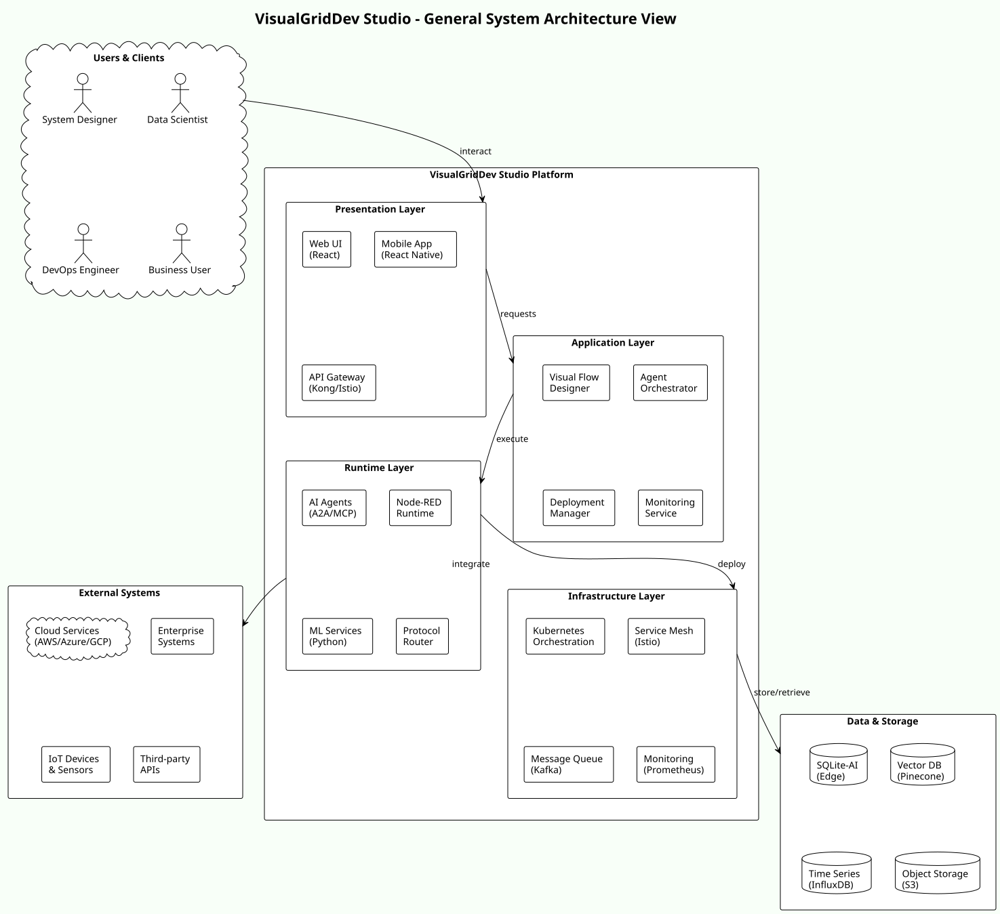

# VisualGridDev

**A draft proposal for a visual agent-orchestration platform built on a single protocol.**

**Specification draft:** v5.0-draft (2025-08-05), under revision
**Repository status:** architecture specification - **no implementation exists**

---

## Status and boundaries

**This repository contains a specification, not a system.** There is no executable
code, no build, no test suite, and no deployment. Nothing described here has been
built, measured, or independently reviewed.

Earlier drafts described this architecture as "production ready", "complete", and
achieving "100%" protocol compatibility. **Those claims were not supported by
evidence and are being retired.** They survive in older documents as historical
prose, not as statements of fact. Start with [PROJECT_STATUS.md](PROJECT_STATUS.md)
for the evidenced position and the list of known gaps.

What the specification does provide is a design: a proposed protocol, a proposed
platform architecture, and a proposed set of decisions. That is worth reviewing,
provided it is reviewed as a proposal.

## What is proposed

| Element | Proposal | Maturity |
|---|---|---|
| **AGCP** | The Agentic Grid Communication Protocol: one message envelope, with foreign protocols handled by bridges | Interface sketches and schemas only |
| **Protocol bridges** | Adapters that translate a foreign protocol into AGCP and back | Interface definitions for a subset; none built |
| **Visual IDE** | A web-based, event-driven visual programming environment for agentic flows | UI mockups only |
| **Agent roles** | A role vocabulary expressed as configurations of a small primitive set | Taxonomy; reduction proposed in ADR-0005 |
| **Mesh deployment** | Cloud, edge, and peer-to-peer deployment with Kubernetes and GitOps | Narrative and diagrams |
| **Self-healing and self-evolution** | MAPE-K-style control loop and runtime protocol inference | Concepts; safety constraints proposed in ADR-0004 |
| **Compliance mapping** | Analysis mapping to the EU AI Act, NIST AI RMF, GDPR, HIPAA, SOC 2, and ISO/IEC 27001 | Analysis, not certification, and not legal advice |

## The core and extended profile split

The specification currently claims interoperability with a very large protocol
surface. The consequence is that "AGCP-compliant" has no smallest measurable
meaning: there is nothing an implementer can finish.

**This is the single largest obstacle to the specification being useful.** The
proposed remedy is to split it into:

- a **core profile**: the envelope, core transport, identity, errors,
  observability, and the safety boundary; and
- **extension packs**: one per protocol family, independently versioned.

See [docs/adr/0003](docs/adr/0003-core-and-extended-profiles.md) (proposed) and
[CONFORMANCE.md](CONFORMANCE.md) for the requirements this would make testable.

## Where to start

| Document | Why |
|---|---|
| [PROJECT_STATUS.md](PROJECT_STATUS.md) | What exists, what does not, and the known gaps. Read this first. |
| [READING-ORDER.md](READING-ORDER.md) | Four curated reading routes for different reviewers |
| [CONFORMANCE.md](CONFORMANCE.md) | What an implementation would have to satisfy, and what conformance does not mean |
| [GLOSSARY.md](GLOSSARY.md) | Every acronym expanded once |
| [docs/adr/](docs/adr/) | The decisions already made, the open ones, and the reasoning |
| [CHANGELOG.md](CHANGELOG.md) | What changed in this revision |

## Repository structure

| Path | Contents |
|---|---|
| `Architecture/arc42/` | Narrative architecture documents, arc42 structure |
| `Architecture/Extensive/` | Master specification, protocol schemas, deployment, compliance, roadmap |
| `Architecture/Requirements/` | Requirements traceability and pinned standard versions |
| `Architecture/Schemas/` | Machine-readable AGCP envelope, bridge contract, and registry |
| `Architecture/Extensive/diagrams/` | PlantUML sources and rendered SVG |
| `Architecture/Extensive/UI-mockups/` | Interface concept images |
| `docs/adr/` | Architecture decision records |

## Licensing

Dual-licensed by artefact type:

- **Prose and illustration:** CC BY-NC-ND 4.0, see [LICENSE](LICENSE).
- **Normative artefacts** (schemas, conformance requirements, requirement
  statements, diagram sources): Apache-2.0, see [LICENSE-SPEC.md](LICENSE-SPEC.md).

The split exists because the NoDerivatives and NonCommercial terms of
CC BY-NC-ND legally prohibit the conforming implementations this specification is
meant to encourage.

## Contributing

Read [CONTRIBUTING.md](CONTRIBUTING.md) first. The short version: open an issue
before drafting a material change, label every statement as fact, proposal,
assumption, target, or verified result, and do not claim conformance.

Security reports: see [SECURITY.md](SECURITY.md). Participation: see
[CODE_OF_CONDUCT.md](CODE_OF_CONDUCT.md).

## Architecture at a glance

